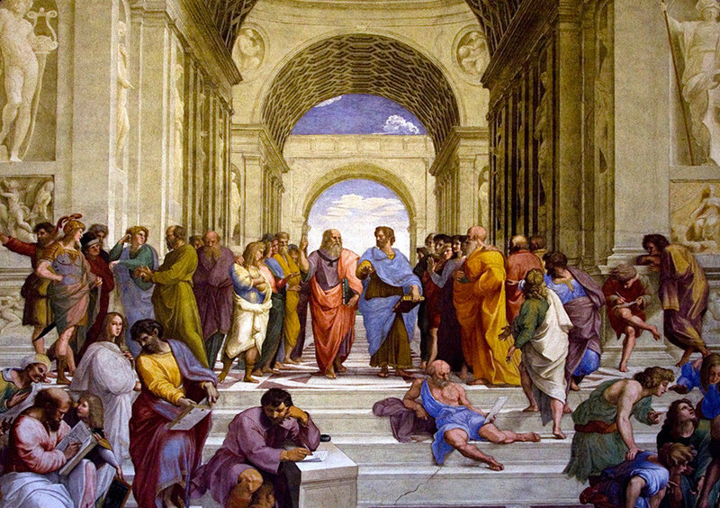

# Gaussian Blur
is a method of blurring an image using the __Gaussian function__, named after the German mathematician __Carl Friedrich Gauss__. This effect is widely used in graphic editors to reduce image noise and detail.
>[!NOTE]
>For a more detailed study of the issue, I am attaching a link to >articles that explain very clearly how this algorithm works.
> 
> [Habr](https://habr.com/ru/articles/151157/)
> 
> [Wiki](https://en.wikipedia.org/wiki/Gaussian_blur)


## Project
In this project I implemented this blur using OpenCV to work with the image matrix and CUDA to speed up the matrix processing. Thanks to CUDA I achieved almost 7x speedup for 8k resolution images

## Code
__To run the program, you need to pass arguments:__
```
./GaussianBlur imgFileName resFileName sigma sizeOfConvMatrix
```

### Example
before


after


